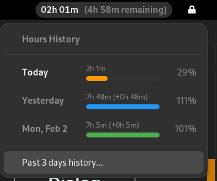
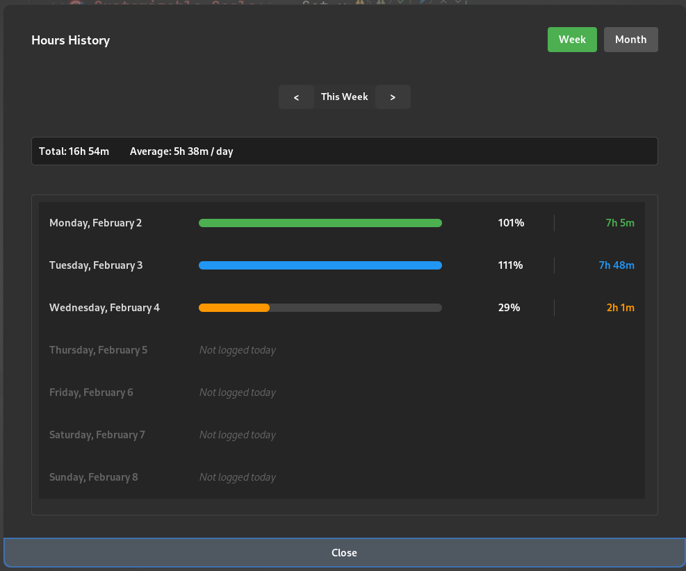
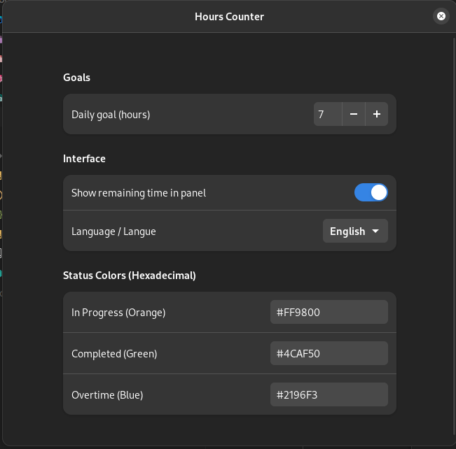

# Hours Counter

<p align="center">
  
  
  
</p>

<p align="center">
  <b>Track your daily working hours directly from the GNOME top panel</b>
</p>

<p align="center">
  <!-- Add your screenshot here -->
  <!--  -->
</p>

---

## ✨ Features

- **📊 Real-time Tracking** — Live counter in the top panel showing hours worked today
- **📈 Visual Progress Bar** — See your daily progress at a glance with color-coded status
- **📅 History Logs** — View your working hours history with weekly and monthly views
- **🎯 Customizable Goals** — Set your daily working hour target
- **⏰ Remaining Time** — Optional display of time remaining to reach your goal
- **🎨 Custom Colors** — Personalize status colors (in progress, completed, overtime)
- **🌍 Multi-language** — English and French support

## 📷 Screenshots

<!-- Add screenshots to a 'screenshots' folder and update paths -->
|             Panel View              |            History Dialog             |                 Settings                  |
|:-----------------------------------:|:-------------------------------------:|:-----------------------------------------:|
|  |  |  |

## 🚀 Installation

### From GNOME Extensions Website (Recommended)

1. Visit [Hours Counter on extensions.gnome.org](https://extensions.gnome.org/extension/XXXX/hours-counter/)
2. Click the toggle switch to install
3. Grant the necessary permissions if prompted

### Manual Installation

```bash
# Clone the repository
git clone https://github.com/Ekyoz/HoursCounter.git

# Navigate to GNOME extensions directory
cd ~/.local/share/gnome-shell/extensions/

# For GNOME 45+ (Ubuntu 24.04, Fedora 39+, etc.)
cp -r /path/to/HoursCounter/gnome45 hours-counter@Ekyoz.github.io

# For GNOME 42-44 (Ubuntu 22.04, Fedora 36-38, etc.)
cp -r /path/to/HoursCounter/gnome42 hours-counter@Ekyoz.github.io

# Copy schemas (common to both versions)
cp -r /path/to/HoursCounter/schemas hours-counter@Ekyoz.github.io/

# Compile the schemas
glib-compile-schemas hours-counter@Ekyoz.github.io/schemas/

# Restart GNOME Shell (X11: Alt+F2, type 'r', press Enter)
# For Wayland: Log out and log back in

# Enable the extension
gnome-extensions enable hours-counter@Ekyoz.github.io
```

### Using Task (Development)

```bash
# Install the extension locally (auto-detects GNOME version)
task install

# Build zip packages for both versions
task build

# Build for specific version
task build:gnome45
task build:gnome42

# Bump version (patch/minor/major)
task bump -- patch
```

## ⚙️ Configuration

Access settings via:
- **GNOME Extensions app** → Hours Counter → ⚙️ Settings
- **Command line**: `gnome-extensions prefs hours-counter@Ekyoz.github.io`

### Available Settings

| Setting | Description | Default |
|---------|-------------|---------|
| **Daily Goal** | Target working hours per day | 7 hours |
| **Show Remaining Time** | Display remaining time in panel | Enabled |
| **Language** | Interface language (English/Français) | English |
| **In Progress Color** | Color when working (hex) | `#FF9800` |
| **Completed Color** | Color when goal reached (hex) | `#4CAF50` |
| **Overtime Color** | Color when exceeding goal (hex) | `#2196F3` |

## 🎨 Status Colors

- 🟠 **Orange** — Working in progress (< 100%)
- 🟢 **Green** — Goal reached (100% - 105%)
- 🔵 **Blue** — Overtime (> 105%)

## 📁 Data Storage

Your working hours history is stored locally at:
```
~/.local/share/hours-counter/time_data.json
```

## 🔧 Requirements

- GNOME Shell 42, 43, 44, 45, 46, 47, or 48
- Ubuntu 22.04+, Fedora 36+, or any GNOME-based distribution

## 📦 Project Structure

This extension supports multiple GNOME Shell versions using separate codebases:

```
HoursCounter/
├── gnome42/           # GNOME 42-44 (legacy imports)
│   ├── extension.js
│   ├── prefs.js
│   └── metadata.json
├── gnome45/           # GNOME 45+ (ESM modules)
│   ├── extension.js
│   ├── prefs.js
│   └── metadata.json
├── schemas/           # Shared GSettings schemas
│   └── org.gnome.shell.extensions.hours-counter.gschema.xml
└── screenshots/
```

### Publishing to extensions.gnome.org

To publish on the GNOME Extensions website, you need to upload **two separate ZIP files**:

1. **For GNOME 45+**: Create a ZIP with `gnome45/` contents + `schemas/`
2. **For GNOME 42-44**: Create a ZIP with `gnome42/` contents + `schemas/`

```bash
# Build both packages
task build

# This creates:
# - hours-counter@Ekyoz.github.io-gnome45.zip
# - hours-counter@Ekyoz.github.io-gnome42.zip
```

Upload each ZIP separately to https://extensions.gnome.org/upload/

## 🤝 Contributing

Contributions are welcome! Please feel free to submit a Pull Request.

1. Fork the repository
2. Create your feature branch (`git checkout -b feature/AmazingFeature`)
3. Commit your changes (`git commit -m 'Add some AmazingFeature'`)
4. Push to the branch (`git push origin feature/AmazingFeature`)
5. Open a Pull Request

## 📄 License

This project is licensed under the GNU General Public License v3.0 - see the [LICENSE](LICENSE) file for details.

## 🙏 Acknowledgments

- GNOME Shell Extensions community
- All contributors and users

---

<p align="center">
  Made with ❤️ for the GNOME community
</p>

<p align="center">
  <a href="https://github.com/Ekyoz/HoursCounter/issues">Report Bug</a>
  ·
  <a href="https://github.com/Ekyoz/HoursCounter/issues">Request Feature</a>
</p>
